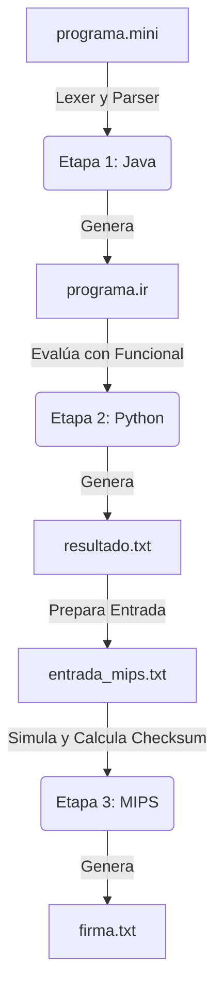

# MiniLang Pipeline — Reto Práctico

## Descripción del Proyecto

El proyecto **MiniLang Pipeline** implementa un traductor y ejecutor por etapas para un lenguaje de programación mínimo y orientado a transformaciones sobre listas llamado `MiniLang`. El sistema, desarrollado como una arquitectura en cadena (pipeline), procesa archivos escritos en este lenguaje utilizando diferentes paradigmas de programación en cada etapa, lo que evidencia el manejo interoperable de lenguajes de alto, medio y bajo nivel.
Integrantes: Anddy Prendas y Alen Matarrita

## Requisitos

Para ejecutar el pipeline en su totalidad, es necesario contar con:
- **Java**: JDK 11 o superior (herramientas `javac` y `java`).
- **Python**: Versión 3.8 o superior (`python` o `python3`).
- **Simulador MIPS**: MARS (MIPS Assembler and Runtime Simulator) a través del archivo `Mars.jar`, o alternativamente QtSPIM.

## Estructura de Carpetas

```
minilang-pipeline/
├── README.md                    <- Documentación general y de ejecución (este archivo)
├── documento_decisiones.md      <- Respuestas académicas a las preguntas de diseño y paradigma
├── diagrama_pipeline.md         <- Diagrama explicativo del flujo y contratos
├── programa.mini                <- Código fuente de ejemplo en MiniLang
├── java/
│   └── src/                   <- Código fuente en Java (Etapa 1: Lexer, Parser y generación de IR)
├── python/
│   └── ejecutar.py              <- Código fuente en Python (Etapa 2: Transformaciones funcionales)
├── mips/
│   ├── preparar_entrada.py      <- Puente adaptador de resultado a MIPS
│   └── firma.asm                <- Código fuente en MIPS (Etapa 3: Checksum de validación)
└── tests/                       <- Archivos de pruebas (.mini) y documentación de salidas
```

## Instrucciones EXACTAS de Ejecución (Paso a Paso)

Ejecuta los siguientes comandos desde la raíz del proyecto.

### 1. Etapa Java (Lexer, Parser y OOP)
Esta etapa valida léxica y sintácticamente el programa y genera la Representación Intermedia (`programa.ir`).

Compilar (solo la primera vez, o cada vez que se modifique el código fuente):
```powershell
javac java\src\*.java
```

Ejecutar sobre el programa de ejemplo:
```powershell
java -cp java\src Main programa.mini programa.ir
```
*Si el código es válido, generará el archivo `programa.ir` en la raíz. Si no lo es, mostrará el error y se detendrá.*

### 2. Etapa Python (Ejecución Funcional)
Esta etapa lee el `programa.ir` y aplica las transformaciones en estilo funcional.
```powershell
python python\ejecutar.py programa.ir resultado.txt
```
*Generará `resultado.txt` en la raíz, que contendrá las trazas y la conclusión de resultados (RESULT y OPERATIONS).*

### 3. Etapa MIPS (Verificación de Bajo Nivel)
Esta etapa prepara las variables del resultado anterior y las procesa en el entorno de ensamblador para generar una firma de verificación.
```powershell
python mips\preparar_entrada.py resultado.txt mips\entrada_mips.txt
java -jar mips\Mars.jar nc mips\firma.asm < mips\entrada_mips.txt
```
*(Nota: Ajusta la ruta a `Mars.jar` según donde tengas el simulador). El programa creará `firma.txt`.*

## Ejecutar el Pipeline Completo para Cada Caso de Prueba

Todos los comandos se ejecutan desde la raíz del proyecto (`minilang-pipeline`),
sin necesidad de moverse con `cd`. La redirección `<` hace que MARS lea
automáticamente los números desde `entrada_mips.txt`, por lo que **no es
necesario teclear nada manualmente** dentro del simulador.

> Nota: si `python` no está reconocido en el sistema, sustituir por `py` en
> todos los comandos. Ajustar la ruta a `Mars.jar` si no está dentro de `mips\`.

### Caso 1 — Programa válido
```powershell
java -cp java\src Main tests\caso1_valido.mini programa.ir
python python\ejecutar.py programa.ir resultado.txt
python mips\preparar_entrada.py resultado.txt mips\entrada_mips.txt
java -jar mips\Mars.jar nc mips\firma.asm < mips\entrada_mips.txt
```

### Caso 2 — Operador de comparación inválido (`>>`)
```powershell
java -cp java\src Main tests\caso2_operador_invalido.mini programa.ir
```
*El pipeline se detiene aquí: se reporta el error de línea 2 y no se genera
`programa.ir`. No se deben ejecutar los comandos de Python ni MIPS para este caso.*

### Caso 3 — Programa sin `DATA`
```powershell
java -cp java\src Main tests\caso3_sin_data.mini programa.ir
```
*El pipeline se detiene aquí: se reporta el error de línea 1 y no se genera
`programa.ir`. No se deben ejecutar los comandos de Python ni MIPS para este caso.*

### Caso 4 — `REDUCE MAX`
```powershell
java -cp java\src Main tests\caso4_reduce_max.mini programa.ir
python python\ejecutar.py programa.ir resultado.txt
python mips\preparar_entrada.py resultado.txt mips\entrada_mips.txt
java -jar mips\Mars.jar nc mips\firma.asm < mips\entrada_mips.txt
```

### Caso 5 — `FILTER` deja la lista vacía
```powershell
java -cp java\src Main tests\caso5_filter_vacio.mini programa.ir
python python\ejecutar.py programa.ir resultado.txt
python mips\preparar_entrada.py resultado.txt mips\entrada_mips.txt
java -jar mips\Mars.jar nc mips\firma.asm < mips\entrada_mips.txt
```

### Caso 6 — Operaciones `FILTER`/`MAP` encadenadas
```powershell
java -cp java\src Main tests\caso6_multiples_ops.mini programa.ir
python python\ejecutar.py programa.ir resultado.txt
python mips\preparar_entrada.py resultado.txt mips\entrada_mips.txt
java -jar mips\Mars.jar nc mips\firma.asm < mips\entrada_mips.txt
```

### Guardar evidencia de un caso antes de correr el siguiente
Como `programa.ir`, `resultado.txt`, `entrada_mips.txt` y `firma.txt` se
sobrescriben en cada corrida, conviene copiarlos con otro nombre después de
cada caso, por ejemplo:
```powershell
copy programa.ir evidencia_caso4.ir
copy resultado.txt evidencia_caso4_resultado.txt
copy firma.txt evidencia_caso4_firma.txt
```

## Diagrama del Pipeline y Contratos



### Contratos de Archivo
- **programa.mini**:
  Archivo de entrada escrito en MiniLang.
  *Ejemplo*:
  ```
  DATA 3 8 5 10 12
  FILTER > 5
  REDUCE SUM
  PRINT
  ```

- **programa.ir**:
  Representación intermedia donde los comandos están purgados de espacios innecesarios y tokens visuales. Separador: `|`.
  *Ejemplo*:
  ```
  DATA|3,8,5,10,12
  FILTER|>|5
  REDUCE|SUM
  PRINT
  ```

- **resultado.txt**:
  Registro con la salida secuencial y final de las transformaciones funcionales.
  *Ejemplo*:
  ```
  [8, 10, 12]
  RESULT=30
  OPERATIONS=2
  ```

- **firma.txt**:
  Contiene los contadores, dígito de verificación y bit de paridad procesado en Ensamblador.
  *Ejemplo*:
  ```
  RESULTADO: 30
  OPERACIONES: 2
  DIGITOS_RESULTADO: 2
  CHECKSUM: 34
  PARIDAD: 0
  ```

## Gramática usada (EBNF)

```ebnf
<programa>   ::= <data> <operacion> { <operacion> } "PRINT"
<data>       ::= "DATA" <numero> { <numero> }
<operacion>  ::= <filter> | <map> | <reduce>
<filter>     ::= "FILTER" <comparador> <numero>
<map>        ::= "MAP" <aritmetico> <numero>
<reduce>     ::= "REDUCE" ( "SUM" | "MAX" | "MIN" )
<comparador> ::= ">" | "<" | ">=" | "<=" | "=="
<aritmetico> ::= "+" | "-" | "*"
<numero>     ::= ["-"] <digito> { <digito> }
<digito>     ::= "0" | "1" | "2" | "3" | "4" | "5" | "6" | "7" | "8" | "9"
```

## Casos de Prueba (Tabla de Resultados)

| Caso | Archivo de entrada | Propósito | Resultado Esperado | Resultado Obtenido |
|------|---------------------|-----------|--------------------|--------------------|
| 1 | `tests/caso1_valido.mini` | Evaluar un programa completo y válido | Pipeline exitoso, RESULT=60, OPERATIONS=3 | Pipeline exitoso, RESULT=60, OPERATIONS=3 |
| 2 | `tests/caso2_operador_invalido.mini` | Detenerse en un operador de comparación incorrecto (`>>`) | Error de compilación en línea 2. No se genera `.ir` | Error detectado por el lexer/parser. Pipeline interrumpido correctamente |
| 3 | `tests/caso3_sin_data.mini` | Intentar iniciar sin declarar un conjunto `DATA` primero | Error en línea 1: el programa debe iniciar con `DATA` | Error reportado: No empieza con `DATA` |
| 4 | `tests/caso4_reduce_max.mini` | Probar una reducción mediante búsqueda de máximo (`REDUCE MAX`) | RESULT=15, OPERATIONS=2 | RESULT=15, OPERATIONS=2 |
| 5 | `tests/caso5_filter_vacio.mini` | Filtro excesivamente estricto que deja una lista vacía para ser sumada | RESULT=0 (Elemento neutro), OPERATIONS=2 | RESULT=0, OPERATIONS=2 |
| 6 | `tests/caso6_multiples_ops.mini` | Verificar operaciones compuestas (dos ciclos FILTER y MAP encadenados) | RESULT=40, OPERATIONS=5 | RESULT=40, OPERATIONS=5 |

## Comportamiento Ante Errores

El proyecto implementa un principio de interrupción temprana (fail-fast). Si la ejecución tropieza con una anomalía en la etapa 1 (Java), ya sea léxica (caracteres extraños) o sintáctica (estructura equivocada o gramática incumplida), se emite un mensaje formateado por consola:
`ERROR DE COMPILACIÓN: Error en línea N: [Motivo]`
En estas circunstancias, **no se genera** el archivo intermedio (`programa.ir`), obligando a detener por completo el pipeline, ya que la etapa posterior de Python espera un archivo de estructura infalible. Del mismo modo, si las etapas posteriores encuentran imposibilidades matemáticas (como obtener el máximo de una lista vacía), también abortan su ejecución imprimiendo sus excepciones subyacentes.

## Fuentes / Documentación Externa Consultada
- Documentación Oficial de Java SE 11 (Manejo de colecciones, herencia y polimorfismo).
- Documentación Oficial de Python 3.8 (`functools.reduce`, paradigma funcional y expresiones).
- Manual MIPS32 y Guías de Uso de MARS IDE para llamadas al sistema (Syscalls) en ensamblador MIPS.
